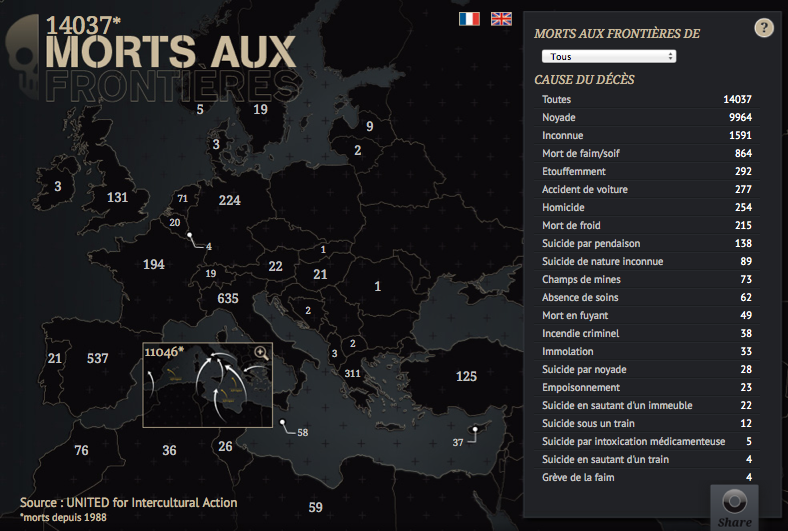

Nous avons demandé à quelques-uns de nos contributeurs de citer leur exemple de datajournalisme favori. Les voici.

#### Do No Harm dans le _Las Vegas Sun_

Mon exemple préféré est [la série « Do No Harm »](http://www.lasvegassun.com/hospital-care/) (« ne pas nuire », précepte de médecine) sur les soins hospitaliers à Las Vegas, réalisée en 2010 par le Las Vegas Sun. En analysant plus de 2,9 millions de factures d’hôpital, le Sun a révélé plus de 3 600 blessures, infections et erreurs chirurgicales évitables. Les journalistes du Sun ont obtenu ces données par le biais de demandes officielles et ont ainsi identifié plus de 300 décès potentiellement évitables. Le dossier contient divers éléments, notamment un graphique interactif permettant au lecteur de voir les hôpitaux commettant plus d’erreurs chirurgicales que la moyenne, une carte avec une frise chronologique indiquant la progression des infections, hôpital par hôpital, et un graphique interactif permettant aux utilisateurs de trier les données par type de dommage ou par hôpital. J’aime ce dossier parce qu’il est facile à comprendre et que l’exploration des données se fait de manière intuitive.

<em>Do No Harm</em> (The Las Vegas Sun)

Il a également eu un véritable impact : l’assemblée du Nevada y a répondu en votant six
nouvelles lois. Les journalistes impliqués ont travaillé très dur pour obtenir et nettoyer les données. L’un d’entre eux, Alex Richards, a renvoyé des données à des hôpitaux et à l’État au moins une douzaine de fois pour faire corriger des erreurs.

_Angélica Peralta Ramos,_ La Nación _(Argentine)_

#### Salaires des fonctionnaires gouvernementaux

J’adore le travail que de petites organisations indépendantes font tous les jours, comme _ProPublica_ ou _The Texas Tribune_, qui emploient l’excellent datajournaliste Ryan Murphy. Si je devais choisir un projet, ce serait [la base de données des salaires des fonctionnaires gouvernementaux développée par _The Texas Tribune_](http://bit.ly/texastrib-employee). Ce projet compile les salaires de 660 000 fonctionnaires gouvernementaux dans une base de données ouverte à tous. Il permet de faire une recherche par agence, nom ou salaire. C’est un outil simple, qui a du sens et rend publiques des informations autrement inaccessibles. Il est facile à utiliser et permet de générer automatiquement des histoires. C’est ce genre de projet qui explique pourquoi _The Texas Tribune_ produit autant de trafic avec ses pages de données.

_Simon Rogers,_ The Guardian

<em>Salaires des fonctionnaires gouvernementaux</em> (<em>The Texas Tribune</em>)

#### Mort aux frontières

Quand j’ai découvert, en 2010, [la liste des migrants morts aux frontières de l’Europe](http://www.unitedagainstracism.org/pages/underframeFatalRealitiesFortressEurope.htm), compilée par United – un réseau de 560 ONG européennes – à partir de dépêches de presse et d’organisations internationales ou de défense des droits de l’homme, j’ai vite vu que le PDF était en fait un extrait d’un tableur, et me suis empressé de leur demander le fichier source. Celui-ci contenait bien plus de paramètres que je n’aurais pu en traiter. J’ai donc dû faire des choix, trouver un angle.

J’aurais pu me contenter d’aligner les chiffres, d’écrire qu’on dénombrait plus de 14 000 morts aux frontières de l’Europe (plus de 16 000 aujourd’hui – sans compter ceux qui n’ont pas été recensés), dont 11 000 en Méditerranée, 194 en France et 59 en Libye, que 9 964 étaient morts noyés, 864 de faim ou de soif, et 215 de froid. J’ai préféré permettre aux gens de pouvoir aussi visualiser, sur une carte, le nombre de migrants morts, par pays, par causes de décès, de pouvoir « lire leur histoire » telles que (brièvement) compilées dans la base de données, mais également montrer l’évolution chronologique de cette mortalité, et enfin, et surtout, de permettre potentiellement à plus de gens de lire l’article que j’ai tiré de ces données, et donc de prendre la mesure de cette tragédie. [Le Mémorial des morts aux frontières de l’Europe](http://owni.fr/2011/02/18/app-la-carte-des-morts-aux-frontieres-de-leurope/) qui en a résulté est probablement le plus dur des articles que j’ai jamais eu l’heur d’écrire. Pas tant parce qu’il m’a fallu attendre plus d’un an avant que je n’obtienne le temps de cerveau disponible d’un développeur – James Lafa – et d’une graphiste – Marion Boucharlat – pour me permettre de le finaliser, ni en raison des galères que cela a pu constituer ou du temps que cela nous a pris (une dizaine de jours), mais à cause de toutes ces histoires que je me suis donc retrouvé à lire, et qui font partie des plus terribles qu’il m’ait été donné de raconter.

_Jean-Marc Manach, journaliste d'investigation_

<em><a href='http://app.owni.fr/mortsauxfrontieres/'>Morts aux frontières</a> (OWNI)</em>

#### Message Machine

J’adore le dossier Message Machine et [le billet s’y rapportant sur le « nerd blog » de ProPublica](http://bit.ly/nerd-blog-post). Tout a commencé quand des « tweetos » se sont étonnés d’avoir reçu des emails différents de la campagne Obama. ProPublica l’a remarqué et a demandé à ses lecteurs de faire suivre tous les emails de la campagne qu’ils avaient reçus. La présentation est élégante et compare visuellement les différents emails qui ont été envoyés ce soir-là. C’est génial parce qu’ils ont recueilli leurs propres données (un faible échantillon, certes, mais suffisant pour raconter l’histoire). Mais ce qui est doublement génial, c’est qu’ils racontent l’histoire d’un phénomène en pleine émergence : l’utilisation de données ciblées dans une campagne politique. Un avant-goût de ce qui nous attend.

_Brian Boyer,_ The Chicago Tribune

<em>Message Machine</em> (<em>ProPublica</em>)

#### Chartball

L’un de mes projets de datajournalisme favoris est l’œuvre d’Andrew Garcia Phillips, [Chartball](http://www.chartball.com/). Andrew est un grand amateur de sport avec une soif inextinguible de données, une vision incroyable en matière de design et un vrai talent de programmeur. Avec Chartball, il visualise non seulement l’ensemble de l’histoire, mais détaille les réussites et les échecs de chaque joueur et équipe. Il offre du contexte, des graphiques attrayants, et son travail est profond, divertissant et intéressant – et pourtant, je ne suis pas fan de sport !

_Sarah Slobin,_ The Wall Street Journal

Charting victory and defeat (Chartball)

