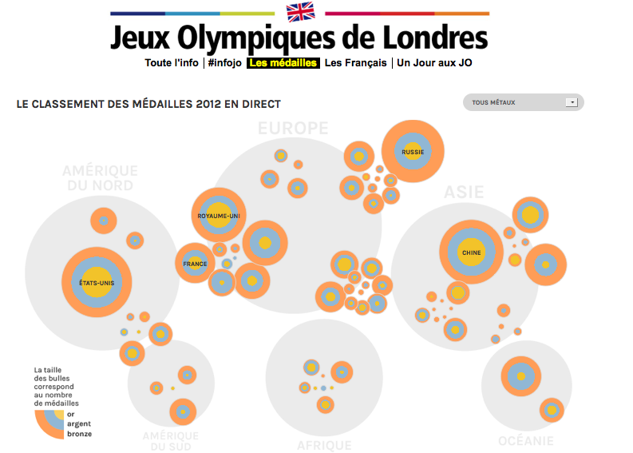

<em><a href='http://www.franceinfo.fr/jeux-olympiques/medailles'>Classement des médailles</a> (France Info)</em>

En juin 2012, j’ai effectué une pige comme journaliste de données pour l’équipe de WeDoData. Cette agence de datavisualisation réalisait [une application pour France Info](http://www.franceinfo.fr/jeux-olympiques/medailles) à l’occasion des Jeux olympiques de 2012. La radio publique voulait proposer à ses internautes une application interactive et ludique pour suivre l’évènement.

Le principe de cette application était simple. Une carte interactive permettait de naviguer dans l’historique des médailles depuis les premiers JO de 1896 jusqu’à ceux de Londres en 2012. Via un système de bulles, le lecteur pouvait comprendre en un coup d’œil les grandes évolutions géopolitiques du sport mondial : la domination des pays anglo-saxons, les rivalités est-ouest ou l’ascension ultrarapide de la Chine.

Sur ce projet, j’ai été chargé de travailler sur la partie données. Voici les différentes étapes de mon travail.

#### Étape 1 : identifier la bonne source, l’évaluer et la « scraper »

Pour commencer, je suis allé sur le site officiel du CIO, la source la plus évidente. Le Comité international olympique proposait en ligne une base de données de tous les athlètes médaillés. Cette source s’est révélée, au fil des vérifications, truffée de plusieurs erreurs. Je l’ai néanmoins utilisée.

Mon premier réflexe a été d’appeler le CIO pour récupérer cette base de données dans un format tableur exploitable. Mais à quelques semaines du début des Jeux olympiques, leur service communication était débordé et, après avoir été baladé un moment, j’ai vite compris que j’irais beaucoup plus vite tout seul.

J’ai donc entrepris de scraper (aspirer) la base de données du CIO. Pour cela, il existe plusieurs outils comme Google Spreadsheet (_via_ la fonction ImportHTML) ou Scraperwiki pour les amateurs de code. Personnellement, j’ai utilisé un outil que je trouve assez génial : le plugin Outwit Hub pour Firefox. Ce couteau suisse du datajournaliste permet, très facilement et sans aucune connaissance en code, de récupérer des bases de données en ligne. En deux heures, mes données ont donc été aspirées et disponibles au format tableur.

#### Étape 2 : nettoyer la base de données

Ma base de données était désormais disponible en format tableur, un fichier CSV d’environ 36 000 lignes, soit une par médaillé olympique. Mais en l’état, elle ne m’était d’aucune utilité. Pourquoi ? Parce que le CIO proposait une base de données des médaillés, or j’avais besoin d’une base de données des médailles, et ce afin de pouvoir faire des classements et des comparaisons par pays et par sport.

Soyons plus concret. Sur la base de données des médaillés du CIO, un relais 4 × 100 m qui a décroché l’or en 2008 se présentait de la manière suivante (sur 5 lignes).

|Pays      | Médaille | Année | Discipline  | Epreuve          | Vainqueur               |
| -------- | -------- |  ---- | ----------- | ---------------- | ------------------------|
|Jamaïque | Or       |  2008 | Athlétisme | Relais 4 × 100 m | Relais 4 × 100 m Jamaica|
|Jamaïque | Or       |  2008 | Athlétisme | Relais 4 × 100 m | Nesta Carter            |
|Jamaïque | Or       |  2008 | Athlétisme | Relais 4 × 100 m | Michael Frater          |
|Jamaïque | Or       |  2008 | Athlétisme | Relais 4 × 100 m | Usain Bolt              |
|Jamaïque | Or       |  2008 | Athlétisme | Relais 4 × 100 m | Asafa Powell            |

Mais c’est une médaille collective, qui ne compte que pour 1 dans les décomptes officiels. Je voulais pouvoir additionner les lignes pour avoir un compte des médailles. Dans ma propre base pour l’application de WeDoData, je n’avais donc besoin que d’une seule ligne pour ce relais 4 × 100 m. Quelque chose qui ressemble à cela :

|Pays      | Médaille | Année | Discipline  | Epreuve          | Vainqueur               |
| -------- | -------- |  ---- | ----------- | ---------------- | ------------------------|
|Jamaïque | Or       |  2008 | Athlétisme | Relais 4 × 100 m | Equipe                  |

Résultat, il me fallait dédoublonner dans cette base toutes les épreuves où plus d’un athlète est engagé (les relais, les doubles en tennis, les sports collectifs...). Là, je me suis dit que cette fonction pouvait s’automatiser sans problème (Excel le permet assez facilement). Sauf existaient dans ma base de données initiale mille petits cas particuliers très agaçants qui m’ont posé problème. En vrac :

* les sports comme la boxe où des demi-finalistes sont tous les deux médaillés de bronze&nbsp;;
* les femmes athlètes qui changent de nom en cours de carrière&nbsp;;
* les erreurs (relativement nombreuses) de la base du CIO&nbsp;;
* les équipes mixtes homme et femme&nbsp;;
* les équipes mixtes deux pays différents (oui&nbsp;; ça existe)&nbsp;;
* les athlètes dopés dont la radiation du palmarès n’est pas mentionnée sur la base du
CIO&nbsp;;
* les _ex aequo_ qui se partagent une médaille...

Au final, une partie a donc été dé-doublonnée automatiquement. L’autre partie du travail a été faite à la main. La tâche peut paraître simple mais elle est extrêmement ingrate et peu stimulante. Pour ce travail, j’ai utilisé non pas Excel mais Open Refine. Cet outil gratuit (développé par Google et aujourd’hui open source) est une sorte de super tableur qui demande un peu de temps de prise en main, mais qui est beaucoup mieux adapté pour travailler sur des grosses bases de données sans s’emmêler les pinceaux.

À la fin de ce travail de dé-doublonnage, il ne me restait « que » 14 000 entrées dans mon tableau sur les 36 000 initiales.

#### Étape 3 : vérifier les informations de la base de données

Une fois ma base de données dé-doublonnée, comme n’importe quel journaliste, j’ai recoupé mes informations. J’ai additionné – sport par sport, pays par pays – toutes mes colonnes et comparé avec les chiffres officiels pour être sûr que les comptes soient ronds. J’ai pu ainsi traquer les erreurs, les miennes et celles – nombreuses du CIO. Au bout des vérifications, les totaux correspondaient. Enfin, pour être sûr, j’ai vérifié mes infos avec celle de Wikipédia (dont les données étaient, au passage, souvent plus exactes que celles du CIO).

#### Étape 4 : harmoniser les catégories et traduire les champs

Ma base de données était donc quasi prête. Restait ensuite à la traduire : 185 épreuves à traduire, c’est long ! Quelques dernières petites bricoles plus tard, le fichier était enfin harmonisé et prêt à l’emploi. Je l’ai envoyé au développeur pour qu’il l’intègre dans l’application. Au total, ce travail m’a pris 4 jours.

_Jean Abbiateci, journaliste indépendant_
